.. _help:

Visualization
=============

a) Zoom in
-----------
To see the finer details on the map, click on the zoom-in icon.

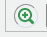

b) zoom-out
-----------
To reduce level of detail or see a bigger part of the map, click on the zoom out icon on the top left section of the map viewer.

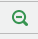

c) Default map extent
----------------------
The default map extent icon ,located on the top left section of the map viewer, takes you to the default map display as designed by the developer. It’s usually used when you 'over zoom-in or out’, and cannot trace back your original area of interest.

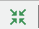

d) Previous history
-------------------
The previous history icon located on the top left section of the map viewer, helps you to move from your current map view to the previous one.

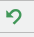

e).Next in history
-------------------
The next history icon, located on the top left section of the map viewer, helps to navigate from you current map view to the next one.

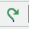

Selecting data 
==============

a. Greenness Indicator
-----------------------
The tab is used to select a greenness indicator such as NDVI, NDVI anomaly, Vegetation Condition Index. Click on the add button to select any of the indicators.

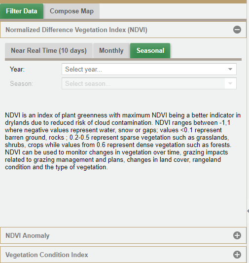

b. Selecting NDVI data
----------------------
NDVI is an index of plant greenness. NDVI ranges between -1,1 where negative values represent water, snow or gaps; values <0.1 represent barren ground, rocks ; 0.2-0.5 represent sparse vegetation such as grasslands, shrubs, crops while values from 0.6 represent dense vegetation such as forests.
We have three filters under this section;

Near Real Time (10 days)
^^^^^^^^^^^^^^^^^^^^^^^^
Choose the year, month and the dekadal which is a time span based on 10 day interval.

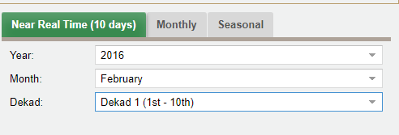

Monthly
^^^^^^^
Choose the year and the month based on the kind of map you want to produce.

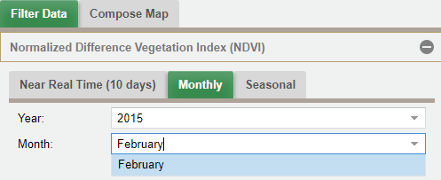

Seasonal
^^^^^^^^
Choose the year and the season. The section provides two season from which you can choose from; the long rains (Mar-Apr-May) and the short rains (Oct-Nov- Dec) season.
 
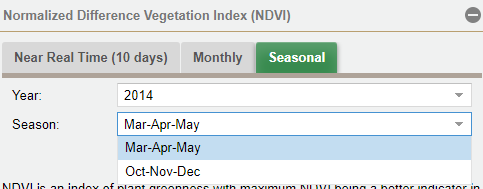

ii) Selecting NDVI Anomalies
----------------------------
We have four options under this section

STD Monthly
^^^^^^^^^^^
Standardized NDVI anomalies basically give a qualitative indication of how "good" or "bad" the current season is when compared with other seasons or with the average situation. Where red represents worsening conditions and green represents improving conditions. They represent the Z score (Monthly NDVI-Long term mean)/Standard Deviation
Choose the year and the month based on the map you want to produce.

Monthly Standardized anomalies
^^^^^^^^^^^^^^^^^^^^^^^^^^^^^^

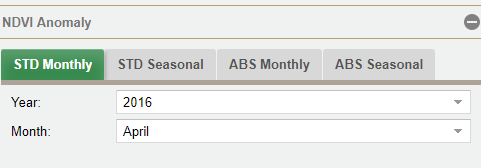

Seasonal Standardized anomalies
^^^^^^^^^^^^^^^^^^^^^^^^^^^^^^^

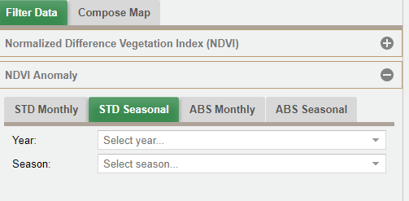

ABS Monthly
^^^^^^^^^^^^
Absolute NDVI anomalies represent differences from long term mean therefore provide a good indication of how the current conditions compare with the average conditions of previous years.

Absolute monthly anomalies (Difference from mean)
^^^^^^^^^^^^^^^^^^^^^^^^^^^^^^^^^^^^^^^^^^^^^^^^^

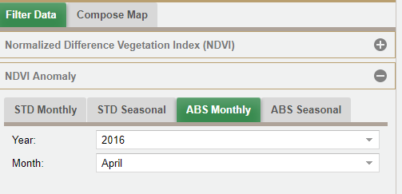

ABS seasonal
^^^^^^^^^^^^
Choose the year and the season; the section provides two season from which you can choose from; the long rains (Mar-Apr-May) and the short rains (Oct-Nov- Dec) season

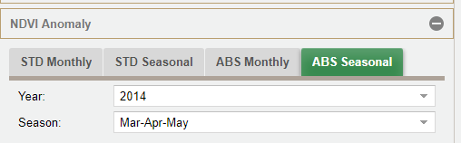

iii).Selecting data based on the Vegetation Condition Index
------------------------------------------------------------
The Vegetation Condition Index (VCI) is an indicator of the current activity of the vegetation relative to the historical range (minimum and maximum NDVI values) calculated for the corresponding time from the long term mean (2000 to present). The VCI thus normalizes the NDVI according to its variability measured over many years and results in a consistent index for various land cover types. Its values range from 0 to 1. VCI values below 0.3 can be interpreted to indicate drought conditions.
We have two options under this section.

Monthly VCI
^^^^^^^^^^^^
Choose the year and the month

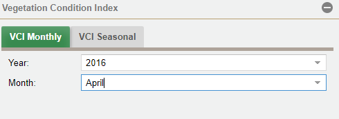

Seasonal VCI
^^^^^^^^^^^^^
Choose the year and the month. The section provides two season from which you can choose from: the long rains (Mar-Apr-May) and the short rains (Oct-Nov- Dec) season

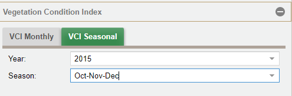

Generating a map
================
This step entails creating a map from selected data.

1. Select the boundary
----------------------
Select the boundary based on the county or conservancy. The selected boundary pops up on the map.

Based on boundary
^^^^^^^^^^^^^^^^^

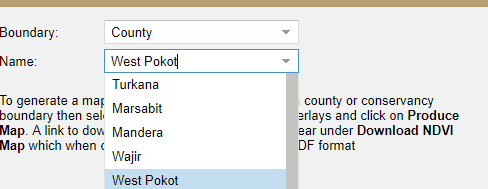

Based on conservancy
^^^^^^^^^^^^^^^^^^^^

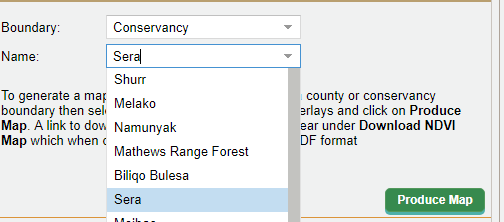

2. Select Additional Information
--------------------------------
Select additional information from Overlays based on the themes; Say invasive species, water sources among others. There are two ways of adding the overlay; from the map area, or under compose map by clicking on the Overlay icon 

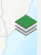

From the map area
^^^^^^^^^^^^^^^^^
Click on the overlay icon on the far right section of the map viewer. Then choose the layers you want to include your map
 
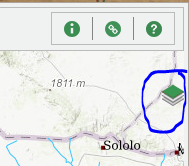

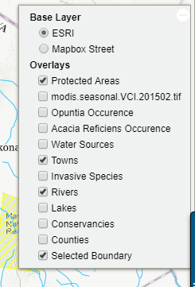
 

Under compose map
^^^^^^^^^^^^^^^^^

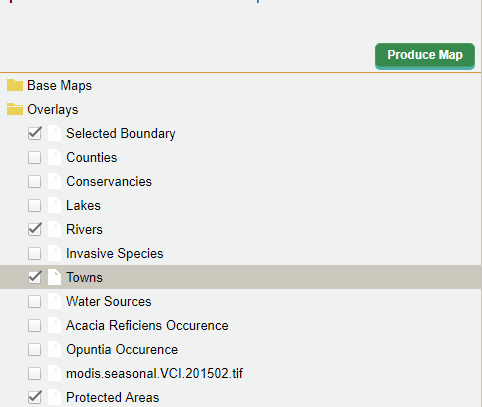

Step by step example of generating a map
-----------------------------------------

1. Select data
^^^^^^^^^^^^^^
Begin by selecting all indicators required to generate a map of Samburu from 10 day NDVI that contains additional data to support interpretation of the map, such as towns, protected areas and rivers. The legend of the map will be displayed on the bottom left of the map viewer.

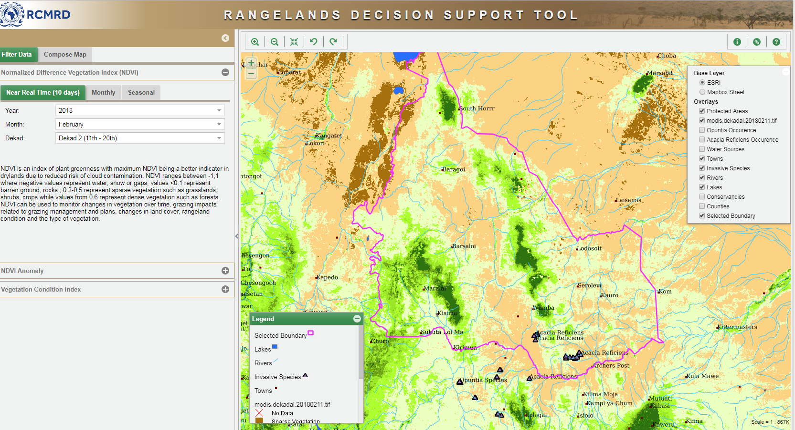

2. Produce the map
^^^^^^^^^^^^^^^^^^
Click the produce map icon to generate the map.

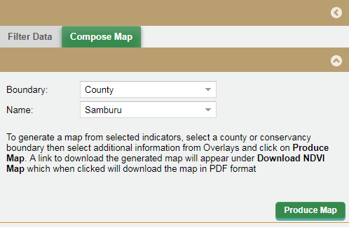

You have to wait for approximately 10 seconds or so depending on the internet connection.

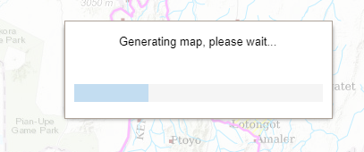

Click ok.
^^^^^^^^^

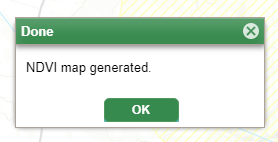

Click on the download icon and select the generated map that you want to view. The name of the map identifies the boundary, greenness indicator and the time it was generated. 

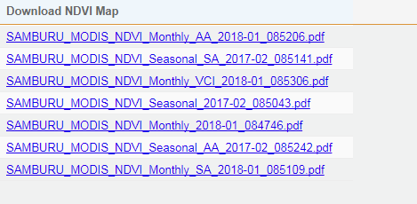

The maps opens in a new tab and gives you the option to download.

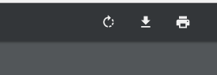

Sample map output

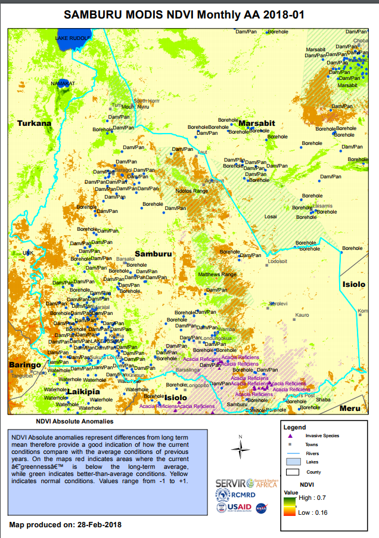

Sample map output for a conservancy

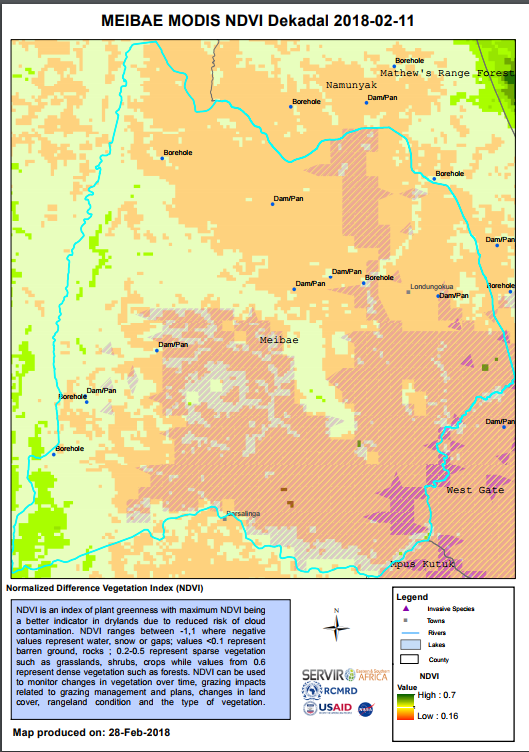

